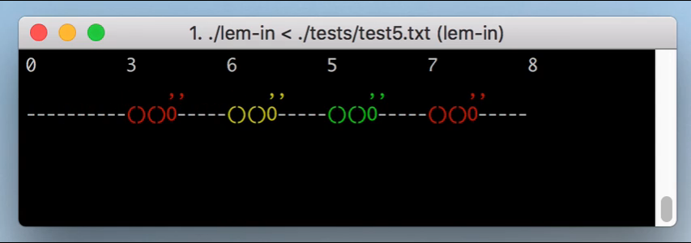

# LEM_IN

Find the shortest path between two rooms, "start" and "finish", with multiple tunnels and roooms in between.

## Introduction

Some students of the School of Wizardry have created Hex, a thinking machine. It is composed of ants for calculus, bee-hives and bees for memory and a mouse for (.. Huh, right, what for already?) cheese (to feed the mouse) and a feather for writing.

We are going to look in depth at its calculus bit. How does it work? Simple! We make an ant farm, with tunnels and rooms; we place the ants on one side; and we look at how they find the exit. How do we build an ant farm? We need tubes and rooms We join the rooms to one another with as many tubes as we need. A tube joins two rooms to each other. No more than that. A room can be linked to an infinite number of rooms and by as many tubes as deemed necessary. Then we must bury the ant farm (wherever you want). This is extremely important to ensure that ants don’t cheat and look at your design before before the game starts. Because arts and crafts with boxes, tape and ropes are not our greatest strength, we will create a digital version instead. The goal of this project is to create an “Hex” simulator. 

## Requirements

- The goal of this project is to find the quickest way to get n ants across the farm.
- Obviously, there are some basic constraints. To be the first to arrive, ants will need
to take the shortest path (and that isn’t necessarily the simplest). They will also
need to avoid traffic jams as well as walking all over their fellow ants.
- At the beginning of the game, all the ants are in the room ##start. The goal is
to bring them to the room ##end with as few turns as possible. Each room can
only contain one ant at a time. (except at ##start and ##end which can contain
as many ants as necessary.)
- We consider that all the ants are in the room ##start at the beginning of the game.
- At each turn you will only display the ants that moved.
- At each turn you can move each ant only once and through a tube (the room at
the receiving end must be empty).
- You must to display your results on the standard output

## Demo

This image show's the final (and shortest) path available in a network of tunnels 
and rooms. The start and finish rooms are '0' and '8' respectively. The rooms along 
this shortest path between '0' and '8' are: 3, 6, 5 & 7.

